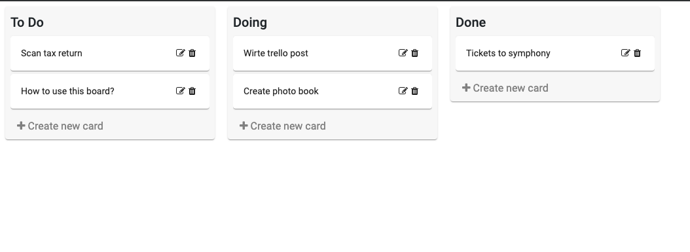
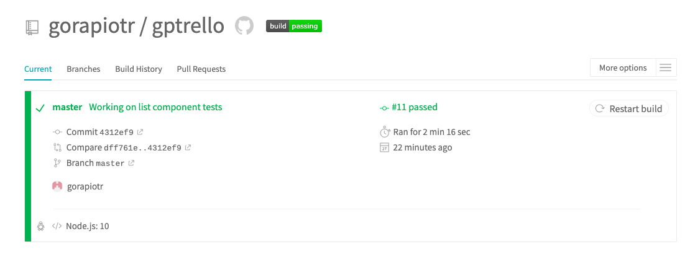

# Gptrello

## Demo
[GpTrello demo instance](http://77.55.210.108:4200/board)
Demo instance app on my VPS - http://77.55.210.108:4200/board.

## Open Source Packages
 * [Angular Material](https://material.angular.io/) - Forms, dialogs .etc
 * [Snotify](https://github.com/artemsky/ng-snotify) - Errors handling
 * [Font-awesome](https://fontawesome.com/) - Icons
 * [Bootstrap](https://getbootstrap.com/) - Styles
 
## Continues integration
[Travis CI for app](https://travis-ci.org/gorapiotr/gptrello)

 
## Development server

Run `ng serve` for a dev server. Navigate to `http://localhost:4200/`. The app will automatically reload if you change any of the source files.

## Code scaffolding

Run `ng generate component component-name` to generate a new component. You can also use `ng generate directive|pipe|service|class|guard|interface|enum|module`.

## Build

Run `ng build` to build the project. The build artifacts will be stored in the `dist/` directory. Use the `--prod` flag for a production build.

## Running unit tests

Run `ng test` to execute the unit tests via [Karma](https://karma-runner.github.io).

## Running end-to-end tests

Run `ng e2e` to execute the end-to-end tests via [Protractor](http://www.protractortest.org/).

## Further help

To get more help on the Angular CLI use `ng help` or go check out the [Angular CLI README](https://github.com/angular/angular-cli/blob/master/README.md).
